# Projet d'Architecture Micro-service

Ce projet vise à développer une compréhension approfondie de l'architecture micro-service à travers plusieurs axes centraux.

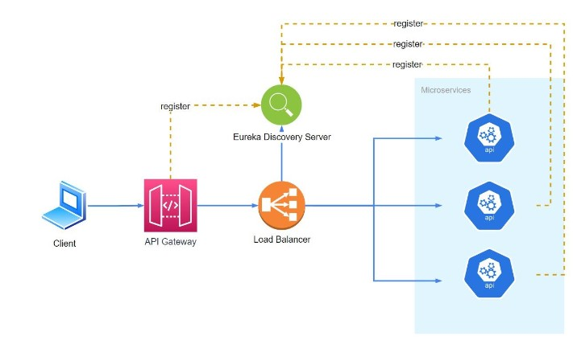

## Objectif du TP

Le but de ce TP est d'acquérir des compétences dans les domaines suivants :
- Création et enregistrement de micro-services
- Connexion à une base de données MySql
- Mise en place d'un micro-service Gateway
- Implémentation d'une communication synchrone entre les micro-services en utilisant l'outil OPENFEIGN

## Architecture Micro-service

Nous adoptons une architecture basée sur les microservices, caractérisée par la décomposition d'une application en de petits services indépendants. Les microservices clients sont des entités autonomes qui interagissent pour fournir une fonctionnalité complète. L'API Gateway agit en tant que point d'entrée centralisé, simplifiant la gestion des requêtes en dirigeant le trafic vers les microservices appropriés. Le serveur de découverte Eureka joue un rôle crucial en permettant à chaque microservice de s'enregistrer dynamiquement, formant ainsi un annuaire décentralisé des services disponibles.

## 1. Configuration Eureka Server

- Ajoutez les configurations nécessaires dans le fichier `application.properties`.
- Lancez le serveur Eureka.
  
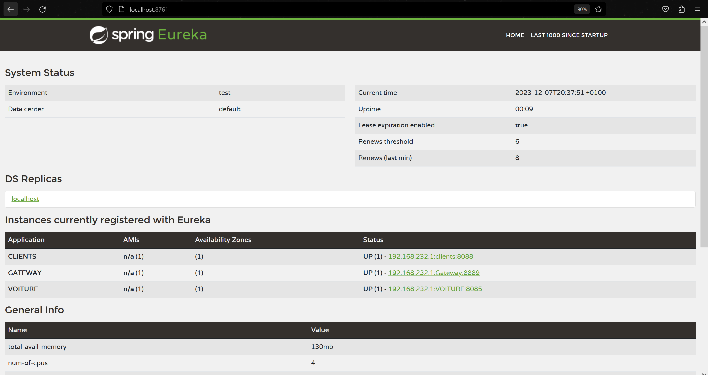

## 2. Configuration Gateway

- Créez un nouveau projet sur Spring Initializr avec la dépendance Spring Cloud Gateway.
- Ajoutez les configurations nécessaires dans le fichier `application.properties`.
- Configurez les règles de routage pour diriger le trafic vers les microservices appropriés.
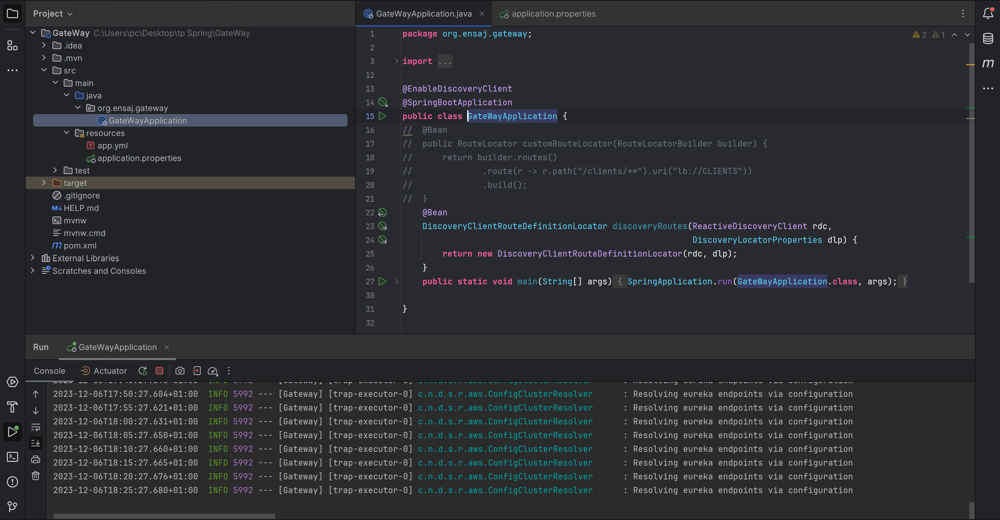

## 3. Création Microservice Client

### 3.1 Configuration MySQL

- Ajoutez les propriétés MySQL dans le fichier `application.properties`.
  
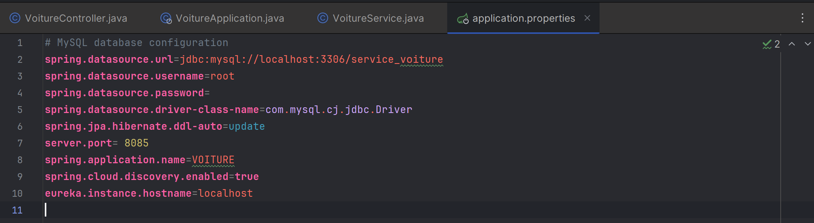
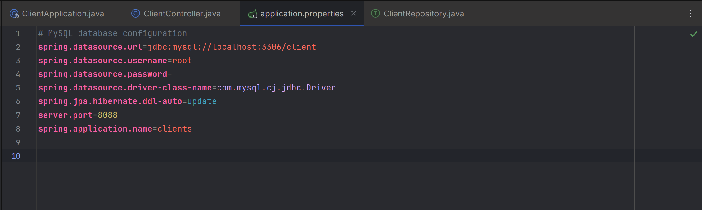

### 3.2 Application Client

- Implémentez la classe principale du microservice client.
- Ajoutez les couches nécessaires (modèle, repository, contrôleur, service).
- Enregistrez le microservice client dans Eureka Server.
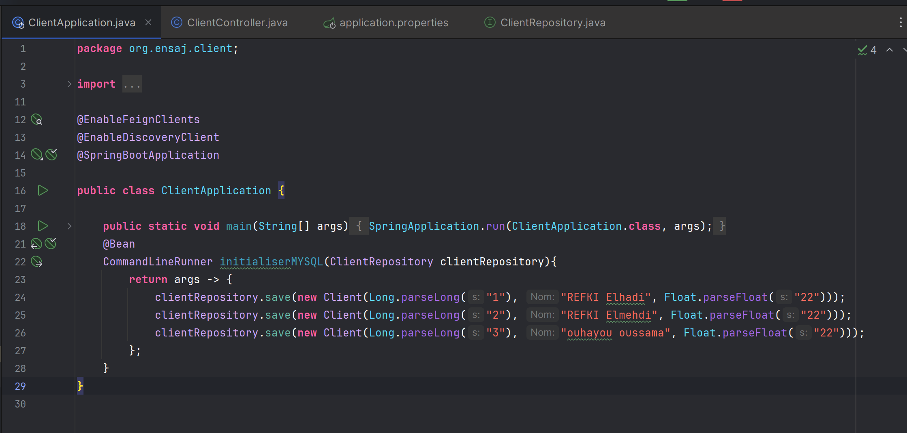

## 4. Création Microservice Voiture

### 4.1 Configuration MySQL

- Ajoutez les propriétés MySQL dans le fichier `application.properties`.
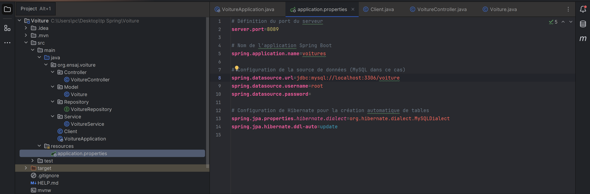

### 4.2 Application Voiture

- Implémentez la classe principale du microservice voiture.
- Modélisez les données avec les associations nécessaires.
- Enregistrez le microservice voiture dans Eureka Server.
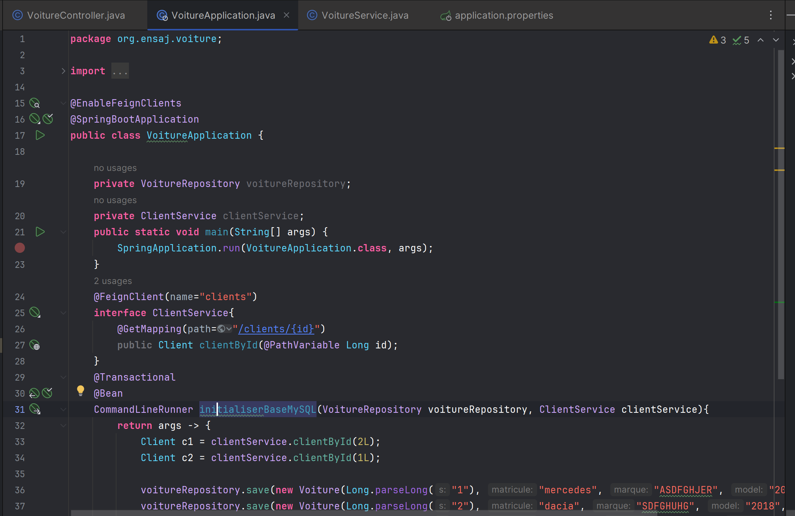

## 5. Enregistrement des Microservices dans Eureka Server

- Assurez-vous que les microservices sont correctement enregistrés dans Eureka Server.

## 6. Création Automatique de la Base de Données avec Spring JPA

- Utilisez Spring JPA pour créer automatiquement la base de données en fonction des entités.
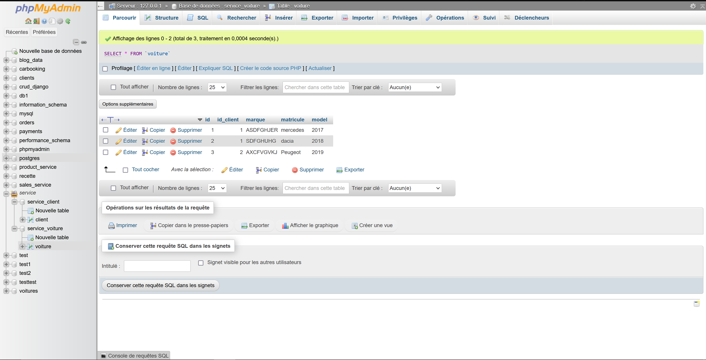
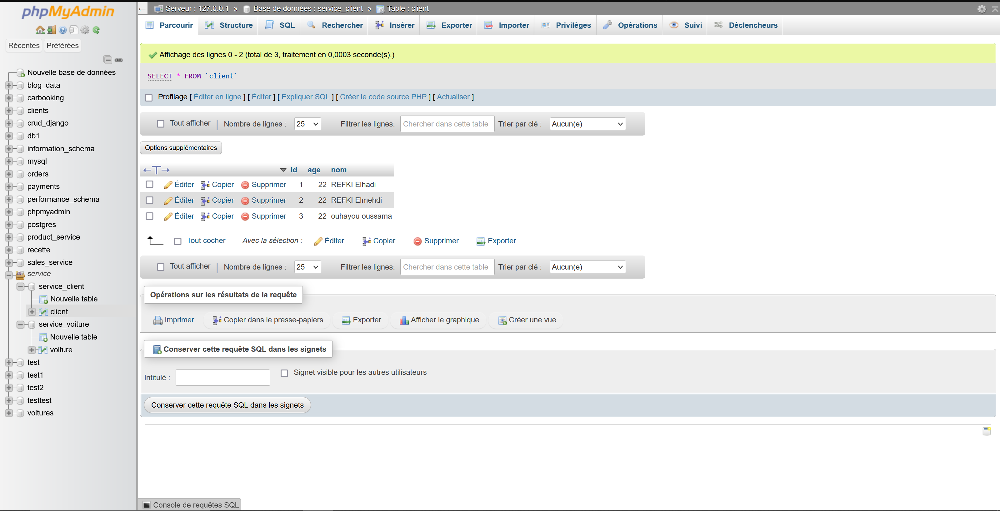

## 7. Tests des Méthodes pour Client et Voiture

### 7.1 Méthodes GET pour Client
- Testez la méthode GET pour récupérer toutes les voitures.
  
 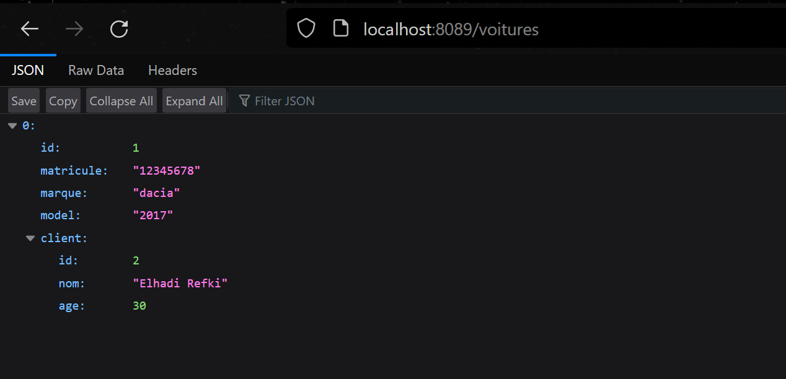

- Testez la méthode GET par ID pour récupérer un client spécifique.
  
  

### 7.2 Méthodes GET pour Voiture

- Testez la méthode GET pour récupérer toutes les voitures.
  
 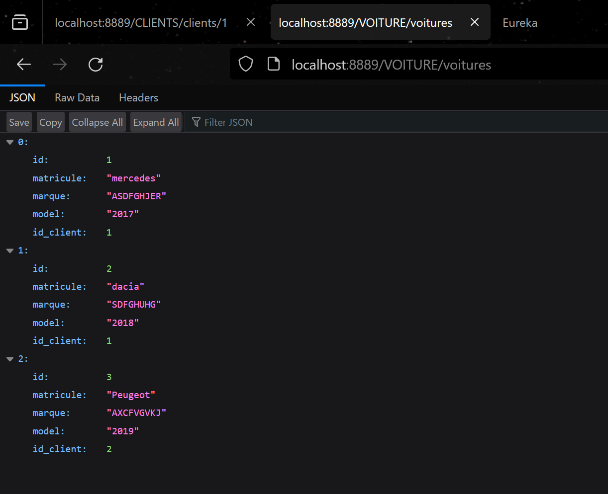
 
- Testez la méthode GET par ID pour récupérer une voiture spécifique.
  
  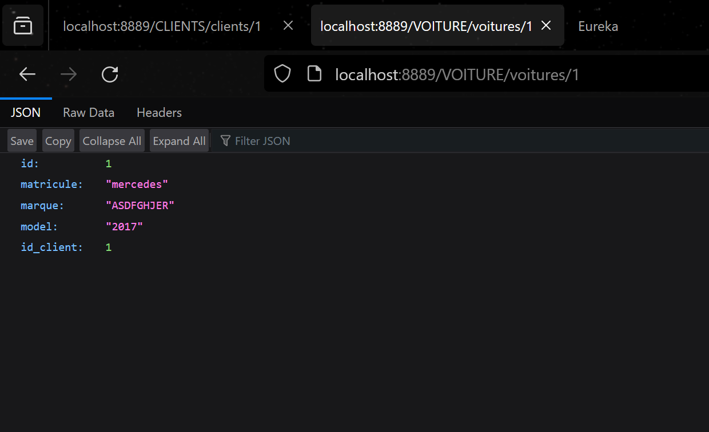

